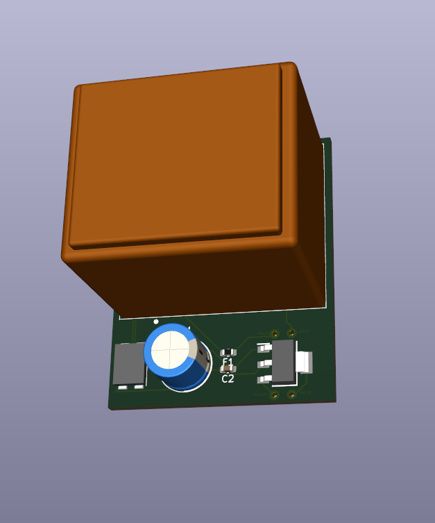
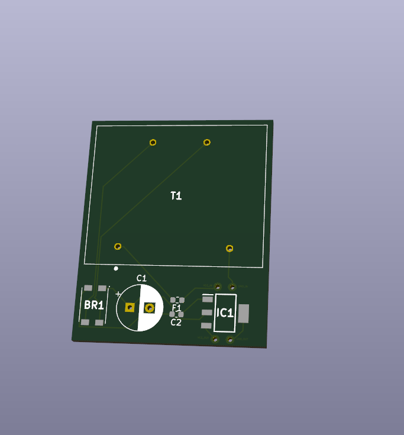
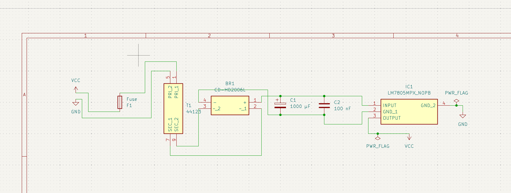

# PSU 5 Volts - My first PCB design project

A man once said _"People who are very serious at software, should start making their own hardware"_.

I'm not serious at software at all nor willing to make my own hardware. This is just a simple KiCad brick to my portfolio of stuff that I enjoy doing. Everything could be wrong.

Simple power supply that inputs **~230V AC home current and outputs ~5V DC**, useful for powering small devices like smartphones, game consoles and stuff like that. (Why would you use this? This is just for training purposes)

You can assembly and produce this project on [jlcpcb.com](https://jlcpcb.com) or [pcbway.com](https://pcbway.com). ⚠️ For the sake of your life don't do it.

    
    

## Schematics

